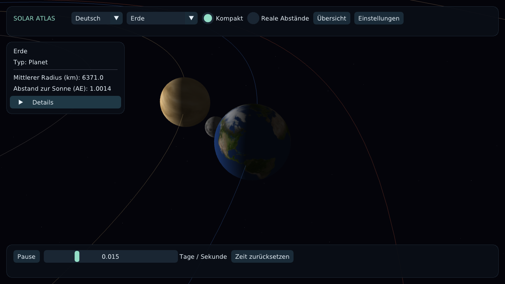

# Sonnensystem

Interaktive 3D-Visualisierung des Sonnensystems mit **C++17**, **raylib** und **Dear ImGui**.
Planetenbewegungen erkunden, Berechnungsmodelle wechseln und Himmelskörper untersuchen.

[English: full documentation](README.md)

**[Interaktive Demo im Browser starten](https://zbybko.github.io/solar-system/)**

Die WebAssembly-Version verwendet das Kepler-Modell. Empfohlen wird ein Desktop-Browser
mit WebGL und Maus. Jeder Push auf `main` aktualisiert die Demo automatisch über GitHub Actions.

## Funktionen

- Sonne, acht Planeten, Erdmond und Saturnringe.
- Orbitkamera und freier Flug, Objektauswahl per Maus und Kameraverfolgung.
- Einstellbare Simulationsgeschwindigkeit, Pause, Umlaufbahnen und Raster.
- Kompakte Darstellung mit vergrößerten Körpern oder reale Abstände und Körpergrößen in einem gemeinsamen Maßstab.
- Himmelskörper-Auswahl mit automatischer Kamerafokussierung und optionalem Auswahlgitter (standardmäßig aus).
- Dunkle Atlas-Oberfläche mit kompakter Navigation, Infokarten, Zeitleiste und ausklappbaren Einstellungen.
- Langsame Wiedergabe als Standard und logarithmische Geschwindigkeitsregelung.
- Gefilterte Saturnringe mit Mipmaps und einer feineren Kontur; Kantenglättung, soweit vom Grafiksystem unterstützt.
- Beleuchtung durch die Sonne, Sternenhintergrund und Informationen zum gewählten Körper.
- Oberflächentexturen für Sonne, Planeten und Mond mit korrigierter Polausrichtung.
- Sprachwechsel zwischen **Deutsch, Englisch und Russisch**, ohne Neustart.
- Austauschbare Ephemeridenmodelle: Kepler/JPL und optional libnova.

## Technischer Hintergrund

Das Projekt entstand als Hochschulprojekt zur objektorientierten Programmierung.
Es verwendet RAII zur Ressourcenverwaltung, `std::unique_ptr` für Besitzverhältnisse
und das Strategie-Muster für austauschbare Positionsberechnungen.
Simulation, Kamera, Rendering und Benutzeroberfläche sind in getrennten Komponenten organisiert.

Der [Entwicklungsplan](ROADMAP.md) dokumentiert die ursprünglichen acht Phasen,
abgeschlossene Meilensteine und noch offene Abschlussaufgaben (auf Englisch).

Es handelt sich um eine Lernvisualisierung, nicht um ein hochpräzises astronomisches Werkzeug.
Die Mondbahn ist vereinfacht. Nur im kompakten Modus sind Körpergrößen und Mondabstand überhöht. Im realen Maßstab sind Planeten in der Gesamtansicht sehr klein; die Himmelskörper-Auswahl ermöglicht die Nahansicht. Die Körper werden als Kugeln dargestellt, die Ringproportionen sind angenähert.
ROS und Robotersteuerung sind nicht Bestandteil des Projekts.

## Sprache auswählen

Im Sprachmenü der oberen Leiste **Deutsch** auswählen. Daneben lässt sich ein Planet auswählen.
**Einstellungen** enthält Umlaufbahnen, Raster, Auswahlgitter, Beleuchtung und Kameramodus.
Berechnungsmodell, FPS und Julianisches Datum stehen unter **Entwicklerdetails**.
Die Wiedergabesteuerung bleibt am unteren Rand sichtbar.
Die Auswahl gilt für die laufende Sitzung. Alternativ vor dem Start `SS_LANGUAGE=de` setzen.
Englisch ist die Standardsprache; Russisch bleibt verfügbar.

## Starten

Benötigt werden ein C++17-Compiler, CMake ab 3.21, Ninja und vcpkg.
Die vollständige Anleitung für Windows, macOS und Linux sowie Tests und bekannte
Einschränkungen stehen im [englischen README](README.md#build-and-run).
