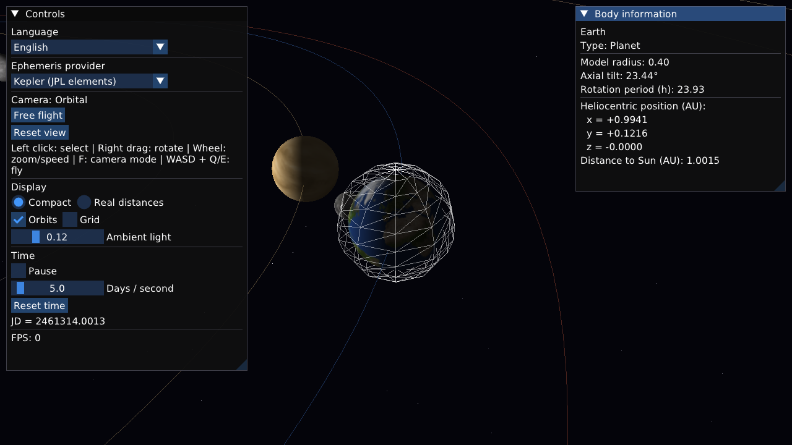

# Solar System

An interactive 3D solar system visualization built with **C++17**, **raylib** and **Dear ImGui**.
Explore planetary motion, switch orbital models, and inspect celestial bodies in English, German or Russian.

[Deutsch](README.de.md)



*Actual application capture using the built-in Kepler provider and colored model surfaces.*

## Overview

Originally built as a university object-oriented programming project, Solar System brings together
numerical calculations, real-time graphics and a modular C++ architecture.
It is an educational visualization, not a mission-planning or high-precision astronomy tool.

See the [development roadmap](ROADMAP.md) for the original eight-stage plan,
completed milestones and remaining finalization tasks.

## Features

- Sun, eight planets, Earth's Moon and Saturn's rings.
- Orbit and free-flight cameras, mouse selection and body tracking.
- Simulation pause, adjustable time speed, orbit paths and a reference grid.
- Compact and real-distance views; body sizes remain exaggerated for readability.
- Sun lighting, a starfield and an information panel with coordinates and rotation parameters.
- Live **English / Deutsch / Русский** switching in the control panel.
- Two interchangeable ephemeris providers: built-in Kepler/JPL calculations and optional libnova.

## Engineering

- **Ownership:** celestial bodies and the ephemeris provider use `std::unique_ptr`; graphics resources are released through RAII.
- **Strategy:** `IEphemeris` decouples position calculations from the scene and allows runtime provider switching.
- **Separation of concerns:** simulation clock, camera, renderer, scene and UI have separate components.
- **Numerics:** the Kepler provider solves Kepler's equation using Newton iteration and transforms orbital coordinates into heliocentric coordinates.
- **Localization:** one typed translation catalog, stable ImGui widget IDs, and a dependency-free completeness test.
- **Build:** CMake, Ninja and a pinned vcpkg dependency baseline.

## Build and run

Requirements: a C++17 compiler, CMake 3.21+, Ninja, Git and [vcpkg](https://github.com/microsoft/vcpkg).
Bootstrap vcpkg following its instructions, then set `VCPKG_ROOT` to its checkout.

macOS / Linux:

```sh
export VCPKG_ROOT=/path/to/vcpkg
cmake --preset default
cmake --build --preset default
./build/bin/solar-system
```

Windows (PowerShell with the Visual Studio C++ build tools available):

```powershell
$env:VCPKG_ROOT = "C:\vcpkg"
cmake --preset default
cmake --build --preset default
.\build\bin\solar-system.exe
```

vcpkg supplies raylib and Dear ImGui. The rlImGui bridge is included in `third_party/`.
libnova is optional: CMake detects a system installation; without it the built-in Kepler provider is used.

## Languages and controls

English is the default. Use **Language** in the control panel to switch without restarting.
The selection lasts for the current session. Set `SS_LANGUAGE=en`, `de` or `ru` to choose a startup language.

| Input | Action |
| --- | --- |
| Left click | Select a body and focus the camera |
| Right drag | Rotate the camera |
| Mouse wheel | Zoom or adjust flight speed |
| F | Toggle orbit / free-flight mode |
| WASD + Q/E | Move in free-flight mode |
| Shift | Faster flight |
| Escape | Exit |

## Checks

Run the translation checks without graphics dependencies:

```sh
cmake -S . -B out/tests -DSOLAR_BUILD_APP=OFF -DBUILD_TESTING=ON
cmake --build out/tests
ctest --test-dir out/tests --output-on-failure
```

The test verifies nonempty translations in all three languages, stable widget IDs and language fallback.
CI runs these checks; it does not replace graphical or numerical validation.

## Limitations

- The built-in Moon model uses a simplified circular orbit. Planet positions are approximations.
- Compact mode, model radii and the Moon's displayed distance are intentionally exaggerated.
- The repository currently uses colored body surfaces; optional texture loading exists, but planet textures are not bundled.
- An earlier version reported a transparent-window issue with GLFW/OpenGL on macOS 26. Window presentation can depend on the OS and graphics stack.
- No ROS integration, robot control or N-body gravitational solver is implemented.

## Assets and dependencies

DejaVu Sans is bundled for multilingual text; see the [DejaVu Fonts license](https://dejavu-fonts.github.io/License.html).
raylib, Dear ImGui, rlImGui and optional libnova retain their respective licenses.
